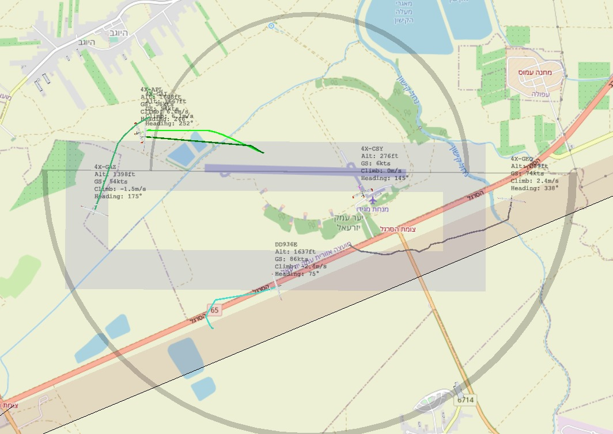

# flarm



## Run in test mode

To run in test mode, we'll emulate a serial port, start the server locally and emulate data into the
serial port.

To start a serial port, run:

```bash
$ socat -d -d pty,raw,echo=0 pty,raw,echo=0
```

This command will write to stderr output of the form:

```
2020/12/28 17:32:35 socat[889481] N PTY is /dev/pts/2
2020/12/28 17:32:35 socat[889481] N PTY is /dev/pts/3
2020/12/28 17:32:35 socat[889481] N starting data transfer loop with FDs [5,5] and [7,7]
```

This means that there were two ports opened. Whatever is written to one of them could be read from
the second, and vise versa. In this example, the ports are mounted on `/dev/pts/2` and `/dev/pts/3`.

To run the server, you need a config file, create a `config.json`, of the form:

```json
{
    "Location": {
        "Lat": 32.6080171,
        "Long": 35.2386547,
        "Alt": 69
    },
    "TimeZone": "Asia/Jerusalem",
    "FlarmMap": {
        "DD8E8B": "APL",
        "DD8E69": "GAY",
        "DDFD21": "GBH"
    },
    "Cesium": {
        "Token": "<your key>",
        "Path": "cesium",
        "AltFix": 50,
        "PathLength": 50,
        "Camera": {
            "Lat": 32.57,
            "Long": 35.25,
            "Alt": 2000,
            "Heading": -30,
            "Pitch": -30
        }
    }
}
```

Now, we'll start the server, reading from the first port:

```
go run . -port /dev/pts/2
```

You can open the browser on `http://localhost:8080` and already see the map.

Finally, we'll simulate FLARM input, by writing to the second port:

```bash
awk '{print $0; system("sleep .1");}' testdata/flarm.txt > /dev/pts/3
```

This command writes the data from `testdata/demp_data.txt` to the second port, with a sleep of 100ms
between each line.